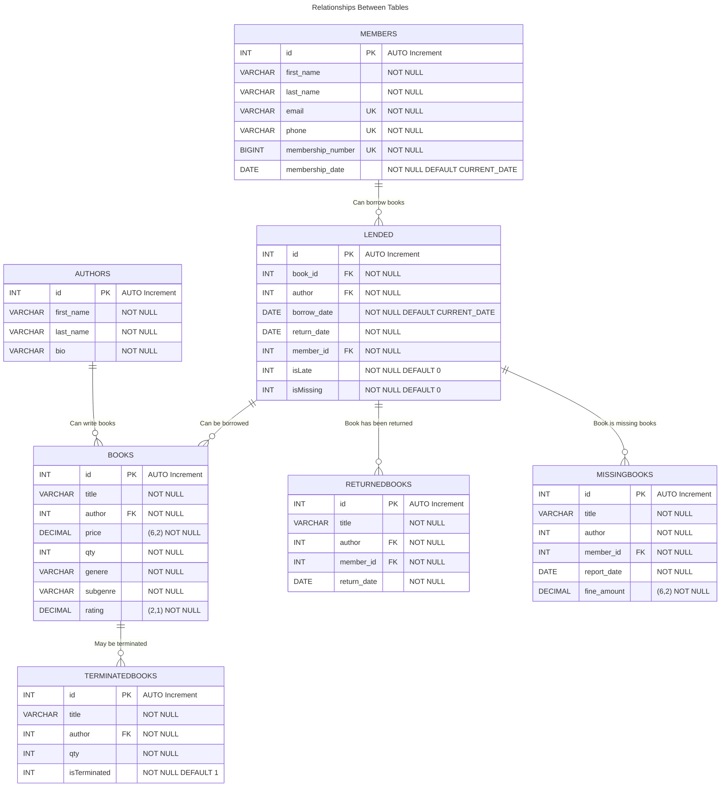

```mermaid
---
title: Relationships Between Tables
---
erDiagram
    BOOKS ||--o{ TERMINATEDBOOKS : "May be terminated"
    LENDED ||--o{ BOOKS : "Can be borrowed"
    MEMBERS ||--o{ LENDED : "Can borrow books"
    AUTHORS ||--o{ BOOKS : "Can write books"
    LENDED ||--o{ RETURNEDBOOKS : "Book has been returned"
    LENDED ||--o{ MISSINGBOOKS : "Book is missing books"

    BOOKS {
        INT id PK "AUTO Increment"
        VARCHAR title "NOT NULL"
        INT author FK"NOT NULL"
        DECIMAL price "(6,2) NOT NULL"
        INT qty "NOT NULL"
        VARCHAR genere "NOT NULL"
        VARCHAR subgenre "NOT NULL"
        DECIMAL rating "(2,1) NOT NULL"
    }

    LENDED {
        INT id PK "AUTO Increment"
        INT book_id FK "NOT NULL"
        INT author FK "NOT NULL"
        DATE borrow_date "NOT NULL DEFAULT CURRENT_DATE"
        DATE return_date "NOT NULL"
        INT member_id FK "NOT NULL"
        INT isLate "NOT NULL DEFAULT 0"
        INT isMissing "NOT NULL DEFAULT 0"
        
    }

    TERMINATEDBOOKS 
    {
        INT id PK "AUTO Increment"
        VARCHAR title "NOT NULL"
        INT author FK "NOT NULL"
        INT qty "NOT NULL"
        INT isTerminated "NOT NULL DEFAULT 1"
    }

    RETURNEDBOOKS 
    {
        INT id PK "AUTO Increment"
        VARCHAR title "NOT NULL"
        INT author FK "NOT NULL"
        INT member_id FK "NOT NULL"
        DATE return_date "NOT NULL"
    }
    MISSINGBOOKS 
    {
        INT id PK "AUTO Increment"
        VARCHAR title "NOT NULL"
        INT author "NOT NULL"
        INT member_id FK "NOT NULL"
        DATE report_date "NOT NULL"
        DECIMAL fine_amount "(6,2) NOT NULL"
    }

    MEMBERS {
        INT id PK "AUTO Increment"
        VARCHAR first_name "NOT NULL"
        VARCHAR last_name "NOT NULL"
        VARCHAR email UK "NOT NULL"
        VARCHAR phone UK "NOT NULL"
        BIGINT membership_number UK "NOT NULL"
        DATE membership_date "NOT NULL DEFAULT CURRENT_DATE"
    }

    AUTHORS {
        INT id PK "AUTO Increment"
        VARCHAR first_name "NOT NULL"
        VARCHAR last_name "NOT NULL"
        VARCHAR bio "NOT NULL"
    }
```