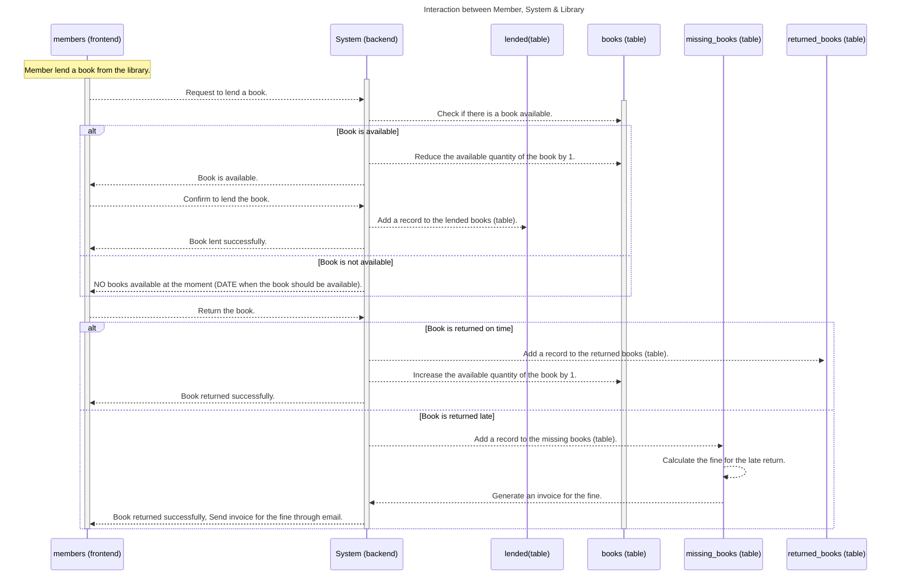

```mermaid
---
title : Interaction between Member, System & Library

---
sequenceDiagram
    participant MEM as members (frontend)
    participant sys as System (backend)
    participant LIB as lended(table)
    participant B as books (table)
    participant MB as missing_books (table)
    participant RB as returned_books (table)

    note over MEM: Member lend a book from the library.
    activate MEM
    activate sys
    MEM -->> sys: Request to lend a book.

    activate B
    sys -->> B: Check if there is a book available.

    alt Book is available
        sys -->> B: Reduce the available quantity of the book by 1.
        sys -->> MEM: Book is available.
        MEM -->> sys: Confirm to lend the book.
        sys -->> LIB: Add a record to the lended books (table).
        sys -->> MEM: Book lent successfully.
    else Book is not available
        sys -->> MEM: NO books available at the moment (DATE when the book should be available).
    end

    MEM -->> sys: Return the book.
    activate RB
    alt Book is returned on time
        sys -->> RB: Add a record to the returned books (table).
        sys -->> B: Increase the available quantity of the book by 1.
        sys -->> MEM: Book returned successfully.
    else Book is returned late
        sys -->> MB: Add a record to the missing books (table).
        MB -->> MB: Calculate the fine for the late return.
        MB -->> sys: Generate an invoice for the fine.
        sys -->> MEM: Book returned successfully, Send invoice for the fine through email.
    end

    deactivate B
    deactivate sys
    deactivate MEM
```