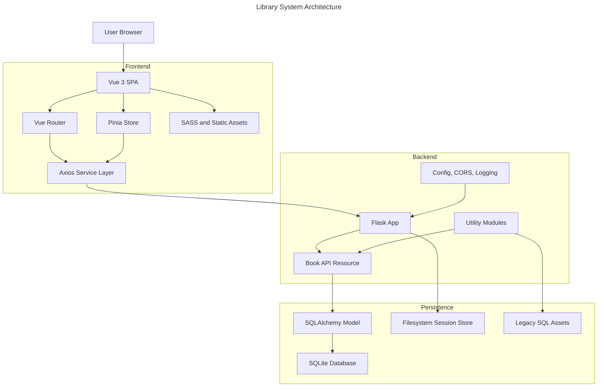

```mermaid
---
title: Library System Architecture
---
graph TD
    user[User Browser]

    subgraph frontend[Frontend]
        vite[Vue 3 SPA]
        router[Vue Router]
        store[Pinia Store]
        services[Axios Service Layer]
        assets[SASS and Static Assets]
    end

    subgraph backend[Backend]
        flask[Flask App]
        endpoint[Book API Resource]
        config[Config, CORS, Logging]
        utils[Utility Modules]
    end

    subgraph persistence[Persistence]
        orm[SQLAlchemy Model]
        sqlite[SQLite Database]
        session[Filesystem Session Store]
        sqlassets[Legacy SQL Assets]
    end

    user --> vite
    vite --> router
    vite --> store
    vite --> assets
    router --> services
    store --> services
    services --> flask
    config --> flask
    flask --> endpoint
    endpoint --> orm
    orm --> sqlite
    flask --> session
    utils --> endpoint
    utils --> sqlassets
```