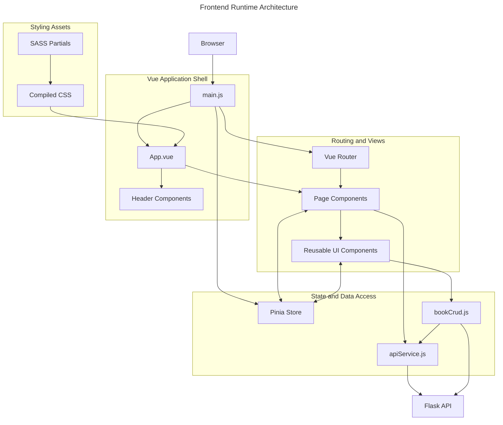

```mermaid
---
title: Frontend Runtime Architecture
---
graph TD
    browser[Browser]

    subgraph appShell[Vue Application Shell]
        main[main.js]
        root[App.vue]
        header[Header Components]
    end

    subgraph navigation[Routing and Views]
        router[Vue Router]
        pages[Page Components]
        widgets[Reusable UI Components]
    end

    subgraph stateAndData[State and Data Access]
        store[Pinia Store]
        api[apiService.js]
        crud[bookCrud.js]
    end

    subgraph styling[Styling Assets]
        sass[SASS Partials]
        css[Compiled CSS]
    end

    backend[Flask API]

    browser --> main
    main --> root
    main --> router
    main --> store
    root --> header
    root --> pages
    router --> pages
    pages --> widgets
    pages <--> store
    widgets <--> store
    pages --> api
    widgets --> crud
    crud --> api
    api --> backend
    crud --> backend
    sass --> css
    css --> root
```